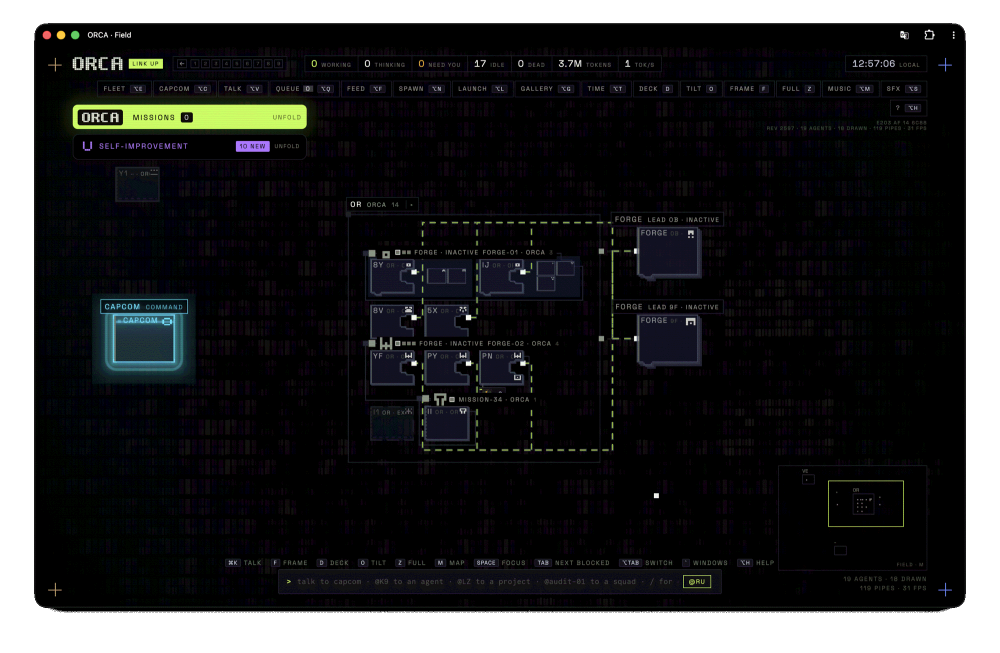

<div align="center">

<br>

# ORCA

**A containment console for fleets of coding agents.**

Watch every agent you run, on every machine, in one field.<br>
Command them all through one voice. Let the fleet improve its own console.

<br>



<br>

<sub>Nineteen agents on the field. Two FORGE squads and a mission wired to their leads. CAPCOM in cyan, standing by.</sub>

<br><br>

</div>

---

## What it is

You run coding agents in more places than you can watch: a laptop, a VPS, a second Mac, a container. Each one is a terminal tab, and the one that needs you is never the tab you are looking at.

ORCA reads what those agents already write to disk and turns it into a single live picture. It does not wrap the agents, does not patch them and never calls a model itself. Claude Code, Codex and Grok sessions appear on the field the moment they start, whoever started them.

Three processes, every connection outbound:

```
collector ──(ws, outbound)──▶  hub  ◀──(ws)──  console
per machine                    │               browser · phone
   └── CAPCOM ──(MCP/http)─────┘
```

A laptop behind NAT and a VPS behind a firewall are equal citizens. Nothing needs an open port but the hub.

---

## The field

There is no dashboard. The whole viewport is an infinite WebGL plane you pan, zoom and tilt.

- **Every agent is a tile.** Its state rides the left edge. A working tile carries a band whose speed is its tokens per second. One waiting on *you* turns amber and breathes. A dead one is a red ghost.
- **Relationships are pipes.** Grey from parent to child, lime while the child lives. An unanswered question is an amber pipe pointing at whoever owes the answer. Two agents editing the same file are joined by a red dotted line.
- **Projects are regions, squads are blocks.** A squad packs its members behind its lead under one outline, with a roster that stays readable when the tiles are specks.
- **Colour is meaning.** Lime is live. Amber means a human is required, and nothing else ever. Red is dead or breach. Violet is ORCA looking at itself.
- **Windows open over the field.** An agent's transcript, its terminal, CAPCOM, the interrupt queue, an artifact it produced: each is a small instrument you drag, pin to a tile or fold into the tray. The field remembers where you put things.
- **Everything answers a right-click**, and every verb has a key.

It holds up. Measured at 3,000 synthetic agents with frame rate, draw calls and DOM nodes reported per size.

---

## CAPCOM

One voice that speaks to the fleet on your behalf.

CAPCOM is itself a Claude Code session, running on your subscription, with the hub as its only tool set over MCP. Tell it what you want in plain language. It spawns agents, forms squads, answers their questions, watches their budgets, stops the ones going in circles and reports back. Anything it cannot decide comes to you as an amber window.

- **46 tools, no `exec`.** Spawn, say, inspect, interrupt, stop, budget, archive, remember, recall, journal. A stolen hub token must never become code execution on your laptop, so there is no shell.
- **Recycled before it forgets.** After a set number of context compactions or turns, CAPCOM hands off to a fresh session with a briefing of what finished since. Missions, rules and workers survive the handoff.
- **Works with a hand on the camera.** CAPCOM can fly you to an agent, frame a squad or open a window while it talks.
- **Push to talk.** Hold `⌥V` and speak. Release, and the line goes in as text.

Without CAPCOM, ORCA is still a fleet monitor: every question goes straight to you.

---

## What the fleet can do

| | |
|---|---|
| **Squads and missions** | A lead with members hanging off it, launched from a brief or a saved preset. A mission is a thread that survives CAPCOM being recycled, and that you open days later to see how it ended. |
| **Agents talk back** | An agent can ask a human, message a peer, hand work to a squad, or raise a warning. The channel is a mailbox of files in the project, so any CLI with a filesystem can use it. |
| **Worktrees** | Each worker gets its own branch. `orca land` rebases it, runs the suite and makes one commit. `orca discard` throws it away. |
| **Terminals** | Hosted agents run in tmux panes. Open one from the console and you are typing into the real CLI, permission prompts included. |
| **Budgets** | A ceiling in tokens or minutes on an agent, a squad or a mission. At 100 % an agent still making progress is reported, one that has gone quiet is stopped. |
| **History** | The hub snapshots the fleet every 20 seconds. Scrub the timeline and the field redraws that instant. "While you were away" diffs then against now. |
| **Journal** | Every launch, end, escalation, answer and landing, one line per fact. Queryable by CAPCOM and from the shell. |
| **Artifacts** | Images, video and HTML an agent produces appear on the field next to the agent that made it. |
| **Many machines** | One collector per machine. A project cloned on several goes to the least busy one. |
| **Credentials** | Keys are encrypted at rest on the machine that holds them and injected at spawn time. The hub only ever sees a name and four characters. |
| **Bounded** | Finished agents, questions, artifacts, snapshots and feed all have ceilings. It is meant to be left running. |

---

## It improves itself

ORCA has a section that looks at the instrument instead of the fleet.

A reviewer agent watches how the console and CAPCOM are actually being used and writes proposals: what gets in the way, what costs too much, what could be better. Nothing happens until you approve one. Then a **FORGE** lead takes the proposal, forms a squad in a worktree, implements it against the test suite and hands the branch to CAPCOM to land.

That is how a good part of this repository was written.

---

## From anywhere

```bash
orca ls --blocked                       # who needs a human
orca spawn AX "fix the flaky auth test" # one agent
orca squad audit --project AX --lead "..." --member "..."
orca say K9 "run the tests again"
orca stop squad:audit --reason "wrong branch"
orca journal --stats --since 7d
```

The console installs as an app on a phone, with push notifications when an agent blocks. Put the hub behind a Tailscale or Cloudflare tunnel and every collector dials out to it. Your laptop never accepts a connection.

---

## Run it

Needs Node 22, `tmux` for hosted terminals, and at least one of the Claude Code, Codex or Grok CLIs.

```bash
git clone https://github.com/danielcardeenas/orca && cd orca
npm install
npm run dev              # hub, collector and console → http://127.0.0.1:4478
```

The hub prints a token on first start. Open the console with `?k=<token>` once and it remembers.

To let agents in a project reach you, run `orca-install` there. It drops a skill into the repo so any session started in it knows it can ask.

---

## Under the hood

```
src/hub          the world: agents, missions, budgets, history, journal, auth, MCP
src/collector    one per machine: reads transcripts, runs panes, carries CAPCOM
src/ui           the console: WebGL field, windows, HUD, voice, PWA
src/agents       CAPCOM's tools
bin/             the orca CLI and the agent-side commands
skill/           what an agent is taught when orca-install runs
test/            unit suites, a visual harness and browser shots
docs/            design records, contracts and delivery notes
```

- [The manual](docs/MANUAL.md) covers every part of the above in depth.
- [DESIGN.md](DESIGN.md) is the visual contract: palette, type, the field, windows.
- Contracts: [escalation](docs/ESCALATION.md), [messaging](docs/MESSAGING.md), [missions](docs/MISSIONS.md), [budgets](docs/BUDGETS.md), [FORGE](docs/FORGE.md), [self-improvement](docs/AUTOMEJORA.md).
- Operations: [remote access](docs/REMOTE-ACCESS.md), [phone](docs/PWA.md), [two Macs](docs/FLEET-MULTI-MAC.md), [production](docs/PRODUCCION.md).

Most design records are in Spanish. The code, the console and the manual are in English.

---

## Tests

```bash
npm run typecheck
npm test                 # every unit suite
npm test -- --changed    # the suites that reach what you touched
npm run shots            # the real console in Chromium, one scene at a time
npm run visual           # photographs every state the console can be in
npm run stress           # 24 → 3,000 agents
```

---

<div align="center">
<sub>ORCA · Orchestration & Reconnaissance Console for Agents</sub>
</div>
