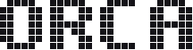

<div align="center">

<br>

<picture>
<source media="(prefers-color-scheme: dark)" srcset="docs/readme/wordmark-dark.svg">

</picture>

<br><br>

**A containment console for fleets of coding agents.**

Run dozens of agents at once, on any machine, from any provider, in one field.<br>
Talk to all of them. Let them talk to each other, and spawn more.<br>
Then ask it to change itself, and watch it do it.

<br>


<br>

<sub>Nineteen agents on the field. Two FORGE squads and a mission wired to their leads. CAPCOM in cyan, standing by.</sub>

<br><br>

<table>
<tr>
<td align="center" width="140">
<picture>
<source media="(prefers-color-scheme: dark)" srcset="docs/readme/icons/claude-dark.svg">

</picture><br>
<sub><b>Claude Code</b></sub>
</td>
<td align="center" width="140">
<picture>
<source media="(prefers-color-scheme: dark)" srcset="docs/readme/icons/codex-dark.svg">

</picture><br>
<sub><b>Codex</b></sub>
</td>
<td align="center" width="140">
<picture>
<source media="(prefers-color-scheme: dark)" srcset="docs/readme/icons/grok-dark.svg">

</picture><br>
<sub><b>Grok</b></sub>
</td>
</tr>
</table>

<sub>One field for all three. Solid, dashed and dotted stripes tell them apart on a tile.</sub>

<br><br>

</div>

---

## What it is

You run coding agents in more places than you can watch: a laptop, a VPS, a second Mac, a container. Each one is a terminal tab, and the one that needs you is never the tab you are looking at.

ORCA reads what those agents already write to disk and turns it into a single live picture. It does not wrap the agents, does not patch them and never calls a model itself. Claude Code, Codex and Grok sessions appear on the field the moment they start, whoever started them.

And ORCA is one of the projects on its own field. It reviews how it is being used, proposes what to change, and, once you say yes, sends a squad to rewrite itself while the fleet keeps running.

Three processes, and one machine is enough:

```
collector ──(ws, outbound)──▶  hub  ◀──(ws)──  console
per machine                    │               browser · phone
   └── CAPCOM ──(MCP/http)─────┘
```

On a laptop, all three run together with `npm run dev`. Want a second machine, a VPS or a container in the fleet? Start a collector there and point it at the hub. It dials out, so nothing anywhere needs an open port, and a laptop behind NAT is as good a citizen as a server.

---

## Many agents, at the same time

ORCA is a user interface for **concurrent** work: not one agent you wait on, but a fleet you converse with while it runs.

- **Every conversation is open at once.** Each agent has its own thread, and the ones that need you are queued so you can answer in order, with `Tab` jumping to the next one. Nothing blocks while you read something else.
- **Providers mix on the same field.** A Claude Code lead can have Codex members and a Grok reviewer. A tile's stripe tells you which is which; everything else, from budgets to terminals to messages, is the same for all of them.
- **One line reaches anyone.** `@K9` to an agent, `@LZ` to a project, `@audit-01` to a squad, nothing to CAPCOM. Reply to a blocked agent from its window, from the queue, from the shell or from your phone.
- **Agents talk to each other.** A worker can ask a peer, hand off to a squad, warn the fleet or escalate to a human, through a mailbox any CLI can write to. CAPCOM routes it, so twenty agents do not interrupt each other twenty times.
- **Agents create agents.** A lead spawns members, members spawn helpers, and the lineage is drawn as pipes so you always see who made whom. A squad or a whole fleet preset launches from one line.
- **Work lasts longer than a session.** A mission is a thread that keeps its agents, its messages and its state across days, across CAPCOM being recycled and across the hub restarting. Hosted agents live in tmux and survive ORCA itself. Budgets, history and the journal are there for the morning after.

---

## The field

There is no dashboard. The whole viewport is an infinite WebGL plane you pan, zoom and tilt.

- **Every agent is a tile.** Its state rides the left edge. A working tile carries a band whose speed is its tokens per second. One waiting on *you* turns amber and breathes. A dead one is a red ghost.
- **Relationships are pipes.** Grey from parent to child, lime while the child lives. An unanswered question is an amber pipe pointing at whoever owes the answer. Two agents editing the same file are joined by a red dotted line.
- **Projects are regions, squads are blocks.** A squad packs its members behind its lead under one outline, with a roster that stays readable when the tiles are specks.
- **Colour is meaning.** Lime is live. Amber means a human is required, and nothing else ever. Red is dead or breach. Violet is ORCA looking at itself.
- **Windows open over the field.** An agent's transcript, its terminal, CAPCOM, the interrupt queue, an artifact it produced: each is a small instrument you drag, pin to a tile or fold into the tray. The field remembers where you put things.
- **Everything answers a right-click**, and every verb has a key.

It holds up. Measured at 3,000 synthetic agents with frame rate, draw calls and DOM nodes reported per size.

---

## CAPCOM

One voice that speaks to the fleet on your behalf.

CAPCOM is not a model ORCA calls. It is an ordinary CLI session, on whatever provider and subscription you already have, with the hub as its only tool set over MCP. ORCA never speaks to a provider directly, and no provider's SDK lives outside its adapter. Tell CAPCOM what you want in plain language. It spawns agents, forms squads, answers their questions, watches their budgets, stops the ones going in circles and reports back. Anything it cannot decide comes to you as an amber window.

- **46 tools, no `exec`.** Spawn, say, inspect, interrupt, stop, budget, archive, remember, recall, journal. A stolen hub token must never become code execution on your laptop, so there is no shell.
- **Any provider, switched live.** Pick its provider and model from the console. Changing either is a handoff: the new session inherits the missions, the rules, the workers and the conversation, and the fleet does not notice.
- **Recycled before it forgets.** After a set number of context compactions or turns, CAPCOM hands off to a fresh session with a briefing of what finished since. Missions, rules and workers survive the handoff.
- **Works with a hand on the camera.** CAPCOM can fly you to an agent, frame a squad or open a window while it talks.
- **Push to talk.** Hold `⌥V` and speak. Release, and the line goes in as text.

Without CAPCOM, ORCA is still a fleet monitor: every question goes straight to you.

---

## What the fleet can do

| | |
|---|---|
| **Squads and missions** | A lead with members hanging off it, launched from a brief or a saved preset. A mission is a thread that survives CAPCOM being recycled, and that you open days later to see how it ended. |
| **Agents talk back** | An agent can ask a human, message a peer, hand work to a squad, or raise a warning. The channel is a mailbox of files in the project, so any CLI with a filesystem can use it. |
| **Worktrees** | Each worker gets its own branch. `orca land` rebases it, runs the suite and makes one commit. `orca discard` throws it away. |
| **Terminals** | Hosted agents run in tmux panes. Open one from the console and you are typing into the real CLI, permission prompts included. |
| **Budgets** | A ceiling in tokens or minutes on an agent, a squad or a mission. At 100 % an agent still making progress is reported, one that has gone quiet is stopped. |
| **History** | The hub snapshots the fleet every 20 seconds. Scrub the timeline and the field redraws that instant. "While you were away" diffs then against now. |
| **Journal** | Every launch, end, escalation, answer and landing, one line per fact. Queryable by CAPCOM and from the shell. |
| **Artifacts** | Images, video and HTML an agent produces appear on the field next to the agent that made it. |
| **Many machines** | One collector per machine. A project cloned on several goes to the least busy one. |
| **Credentials** | Keys are encrypted at rest on the machine that holds them and injected at spawn time. The hub only ever sees a name and four characters. |
| **Bounded** | Finished agents, questions, artifacts, snapshots and feed all have ceilings. It is meant to be left running. |

---

## It knows itself

The console has one section that is not about the fleet. It is about the console.

**It watches how it is used.** ORCA launches a reviewer agent over its own repository. It appears on the field like any other agent, with its callsign, its state and its spend, except that it wears violet and has had its editing tools taken away. It reads how the console and CAPCOM are actually being driven, what gets in the way, what costs too much, what the operator keeps doing by hand.

**It proposes, with receipts.** Each proposal says whether it stands on measured numbers or on a hypothesis, and the card's texture shows which. Invented measurements are rejected before they reach you. Ideas the data cannot support are welcome, as long as they say so.

**You decide.** Nothing happens on its own. Reply, snooze, dismiss, or press IMPLEMENT.

**Then it rewrites itself.** IMPLEMENT opens a mission and hands it to **FORGE**, a lead that forms a squad in a worktree of this repository, implements the change against the type checker and the test suite, and gives the branch to CAPCOM to land. The hub and collector reload under the new code. The agents on the field never notice.

**Or just ask.** ORCA's own repository is a project on the field, so "make the queue louder" said to CAPCOM becomes a worker on this code like any other. Rules you give it are kept and handed to every CAPCOM after it.

A good part of this repository was written this way.

---

## From anywhere

```bash
orca ls --blocked                       # who needs a human
orca spawn AX "fix the flaky auth test" # one agent
orca squad audit --project AX --lead "..." --member "..."
orca say K9 "run the tests again"
orca stop squad:audit --reason "wrong branch"
orca journal --stats --since 7d
```

The console installs as an app on a phone, with push notifications when an agent blocks. Reaching it from outside takes nothing you do not already have:

<table>
<tr>
<td align="center" width="80">
<picture>
<source media="(prefers-color-scheme: dark)" srcset="docs/readme/icons/tailscale-dark.svg">

</picture>
</td>
<td><b>On your tailnet.</b> If Tailscale is on the machine, the hub publishes itself over https at boot, with a real certificate and only to your devices. Nothing to remember after a reboot. Open the console on your phone from the other side of the world.</td>
</tr>
<tr>
<td></td>
<td><b>Without it.</b> On the LAN it is a URL. Behind any tunnel it is the same URL. Set a token before you expose it, and the hub refuses everything else.</td>
</tr>
</table>

---

## Run it

Needs Node 22, `tmux` for hosted terminals, and at least one of the Claude Code, Codex or Grok CLIs.

```bash
git clone https://github.com/danielcardeenas/orca && cd orca
npm install
npm run dev              # hub, collector and console → http://127.0.0.1:4478
```

The hub prints a token on first start. Open the console with `?k=<token>` once and it remembers.

To let agents in a project reach you, run `orca-install` there. It drops a skill into the repo so any session started in it knows it can ask.

---

## Under the hood

```
src/hub          the world: agents, missions, budgets, history, journal, auth, MCP
src/collector    one per machine: reads transcripts, runs panes, carries CAPCOM
src/ui           the console: WebGL field, windows, HUD, voice, PWA
src/agents       CAPCOM's tools
bin/             the orca CLI and the agent-side commands
skill/           what an agent is taught when orca-install runs
test/            unit suites, a visual harness and browser shots
docs/            design records, contracts and delivery notes
```

- [The manual](docs/MANUAL.md) covers every part of the above in depth.
- [DESIGN.md](DESIGN.md) is the visual contract: palette, type, the field, windows.
- Contracts: [escalation](docs/ESCALATION.md), [messaging](docs/MESSAGING.md), [missions](docs/MISSIONS.md), [budgets](docs/BUDGETS.md), [FORGE](docs/FORGE.md), [self-review](docs/AUTOMEJORA.md).
- Operations: [remote access](docs/REMOTE-ACCESS.md), [phone](docs/PWA.md), [two Macs](docs/FLEET-MULTI-MAC.md), [production](docs/PRODUCCION.md).

Most design records are in Spanish. The code, the console and the manual are in English.

---

## Tests

```bash
npm run typecheck
npm test                 # every unit suite
npm test -- --changed    # the suites that reach what you touched
npm run shots            # the real console in Chromium, one scene at a time
npm run visual           # photographs every state the console can be in
npm run stress           # 24 → 3,000 agents
```

---

<div align="center">
<sub>ORCA · Orchestration & Reconnaissance Console for Agents</sub>
</div>
